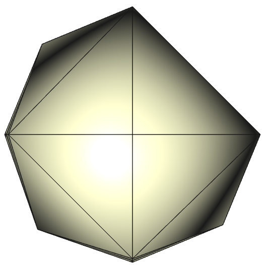
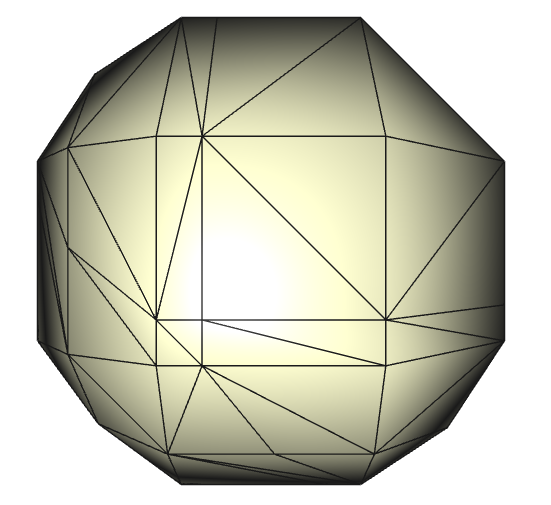
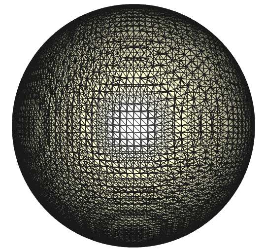
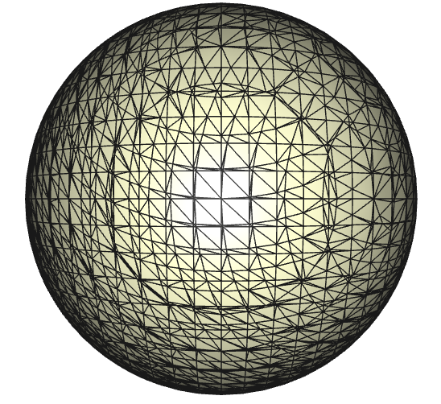

# **Marching Tetrahedra Project**

## **Description:**
The marching tetrahedra algorithm is inspired by the marching cubes algorithm. The objective of this marching cubes algorithm is to reconstruct the surface of some sort of shape or object. By defining a grid of cubes or tetrahedra, one can create triangles in each one that maintain connectivity, forming a 3d mesh. The objective isn't a perfect/even mesh, but one that merely resembles the shape. See my project `remesher-3d` for ways we can make this new mesh better.

## **Building:**
1. This project was built in `flux`. This geometric library can be downloaded at https://gitlab.com/csci422-s22/flux-base
2. Build `flux` and then create a new folder in the projects section
3. Download `marching-tetrahedra` into this new folder
4. Build/make `flux` again and go to `build/debug/projects/marching-tets`
5. Run command `make marchingtets_exe` to make and `./marchingtets_exe` to run

## **The Algorithm:**
The initial step of this algorithm is to define a grid of tetrahedra. Looping through each tetrahedra, we will inspect to see which edges are divided by the objective function (that defines some sort of 3D shape). We can determine the case of the tetrahedra by inspecting the tetrahedron's vertices' isovalues. This step is much easier than marching cubes as there are only 16 cases as opposed to 256. Once the case is determined, we know which edges of the tetrehdron are intersected by the function and where our triangle/triangles will go. We find the intersection points on each edge and add them to this mesh if they aren't already there. We then save their indices, check the orientation of the triangle, and then add this new triangle. In performing these steps on every tetrahedron, we will create a watertight mesh that resembles the given shape function.  
  
**In simpler terms:**
1. Initialize hashtables that correspond to the specific case the edges are in and what triangles that each case should produce as a result
2. Perform preprocessing for each vertex's isovalues
3. Loop through each tetrahedra:
   1. Retrieve vector of isovalues for each vertex
   2. Determine which case the tetrahedra is in
   3. If tetrahedra does intersect with sphere, add intersections to the mesh and create a triangle/triangles

## **Results:**
These results will only be focused on a sphere function as our analytic function. With this, our only input that changes is the dimensions of the tetrahedron grid that assists in the creation of the sphere. The higher number of tetrahedra, the higher number of triangles in teh resulting sphere mesh.

### **2x2x2 Tet Grid**

### **3x3x3 Tet Grid**

### **5x5x5 Tet Grid**

### **10x10x10 Tet Grid**

### **20x20x20 Tet Grid**

### **50x50x50 Tet Grid**
